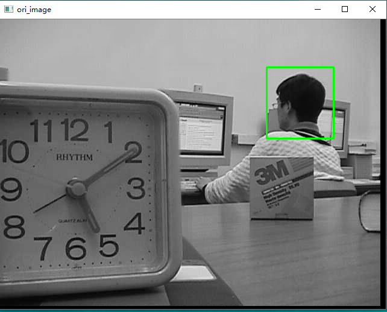
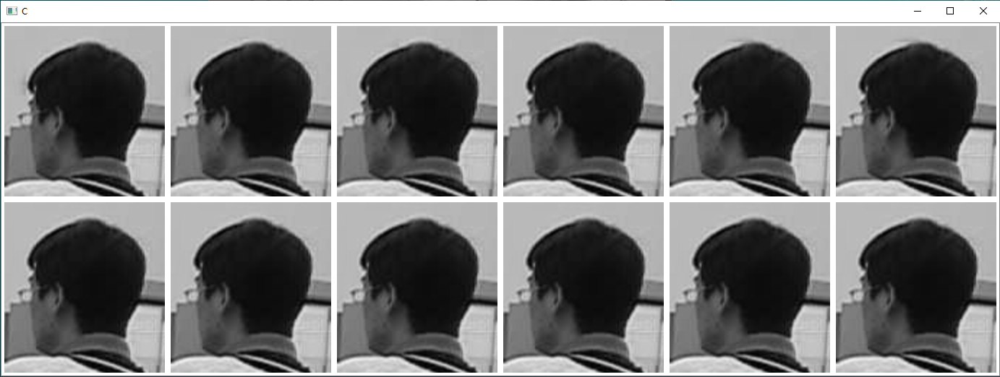
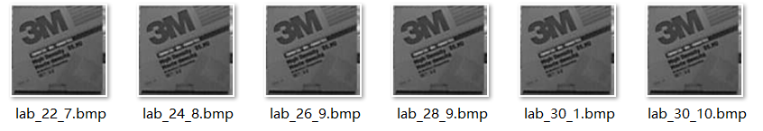

# Tools
## 图像局部放大分析工具

### 使用方法

#### 安装

python 版本 python3

安装需要的库

```
pip install -r requirment.txt
```

#### 运行

1、将需要对比的图形放在imgs文件下

2、原始图像文件名需要包含`_ROI`，现在是只有一张原始图像

3、选择原始图像中想比较的区域

4、选好后，按空格键会显示所有图像的所选区域的放大图，第一行为对应图像的放大图，第二列为原始图像的放大图。

5、如果要退出按回车键。

#### 参数设置

有一些可以选择的参数：

```python
LINE_COLOR = (0, 255, 0)  # 获取在原图上画的线的颜色
LINE_WIDTH = 2  # 在原图上线的宽度
SCALE = 2  # 对选取区域的放大倍数
ADD_BBOX = True  # 是否对要保存的图像增加边框
BBOX_WIDTH = 4   # 增加的边框的宽度
BBOX_COLOR = (255, 255, 255)  # 默认为白色
INTER_METHOD = cv.INTER_LINEAR  # 放大图像的差值方式，默认使用线性插值INTER_LINEAR， 双三次INTER_CUBIC, INTER_LANCZOS4, INTER_LINEAR
```

#### 最终结果

在result中保存了最后一次选择的局部放大图

#### 运行结果展示

1）选择要放大的区域：



2）选好后按空格键画出对比图（默认使用双三次插值放大四倍）



如果不满意可以重新选择，重新作对比图。

3）如果确定后，按回车键保存最后一次选择的结果，并退出.结果保存在result文件夹下




更多关于编程和机器学习资料请关注FlyAI公众号。
![公众号二维码][1]

[1]: http://wshaow.club/wechat/%E5%BE%AE%E4%BF%A1%E5%85%AC%E4%BC%97%E5%8F%B7%E4%BA%8C%E7%BB%B4%E7%A0%81.jpg
